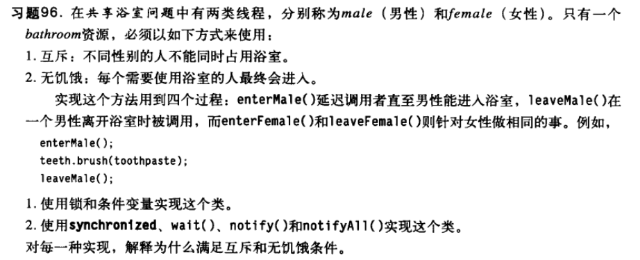
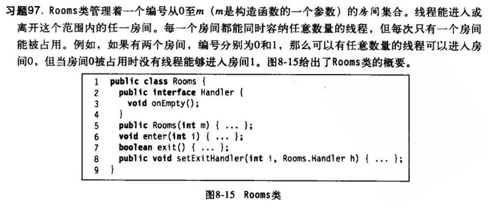
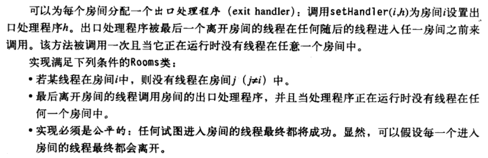

Multicore Programming Homework(7)
---

<h3 align = "right">  _韩云飞 (SA13226297)_  </h3 >

--------------------




1.锁和条件变量的实现

```java 
import java.util.concurrent.locks.Condition;
import java.util.concurrent.locks.Lock;
import java.util.concurrent.locks.ReentrantLock;

public class Bathroom
{
	private Lock lock;
	private Condition maleCond;
	private Condition femaleCond;
	private int maleAcq;
	private int maleRel;
	private int femaleAcq;
	private int femaleRel;
	private int maleWait;
	private int femaleWait;
	
	public static final int MALE = 1;
	public static final int FEMALE = 2;
	
	public Bathroom()
	{
		lock = new ReentrantLock();
		maleCond = lock.newCondition();
		femaleCond = lock.newCondition();
	}
	
	public void enterMale()
	{
		lock.lock();
		try
		{
			maleWait ++;
			while((femaleWait != femaleAcq && maleAcq != maleRel) 
					|| (femaleAcq != femaleRel))
			{
				maleCond.await();
			}
			
			maleAcq ++;
		}catch(Exception e)
		{
			e.printStackTrace();
			maleWait --;
			maleCond.signalAll();
			femaleCond.signalAll();
		}finally
		{
			lock.unlock();
		}
	}
	
	public void leaveMale()
	{
		lock.lock();
		maleRel ++;
		if(maleRel == maleAcq)
		{
			femaleCond.signalAll();
		}
		lock.unlock();
	}
	
	public void enterFemale()
	{
		lock.lock();
		try
		{
			femaleWait ++;
			while((maleWait != maleAcq && femaleAcq != femaleRel) 
					|| (maleAcq != maleRel))
			{
				femaleCond.await();
			}
			femaleAcq ++;
		}catch(Exception e)
		{
			e.printStackTrace();
			femaleWait --;
			maleCond.signalAll();
			femaleCond.signalAll();
		}finally
		{
			lock.unlock();
		}
	}
	
	public void leaveFemale()
	{
		lock.lock();
		femaleRel ++;
		if(femaleRel == femaleAcq)
		{
			maleCond.signalAll();
		}
		lock.unlock();
	}
}
```
> ### 通过锁lock()和unlock()来保证互斥，根绝男女性的等待数和释放数作为判断条件，通过signalAll()来避免线程出现饥饿。


2.使用sychronized(), wait(), notify(), notifyAll()实现

```java
import java.util.Random;
class Bath
{
	int males;
	boolean male;
	int females;
	boolean female;
	public Bath()
	{
		this.male=false;
		this.males=0;
		this.female=false;
		this.females=0;
	}
	public synchronized void enterMale()
	{
		System.out.println("Male wait");
		while(female==true)
		{	
			try
			{
				this.wait();
			} catch (InterruptedException e)
			{
				e.printStackTrace();
			}
		}
		System.out.println("Male in");
		this.male=true;
		this.males++;
	}
	public synchronized void leaveMale()
	{
			this.males--;
			System.out.println("Male out");
			if(this.males==0)
			{
					this.male=false;
					this.notifyAll();
			}
	}
	public synchronized  void enterFemale()
	{
		System.out.println("Female wait");
		while(male==true)
		{	
			try
			{
				this.wait();
			} catch (InterruptedException e)
			{
				e.printStackTrace();
			}
		}
		System.out.println("Female in");
		this.female=true;
		this.females++;
	}
	public synchronized  void leaveFemale()
	{
		this.females--;
		System.out.println("Female out");
		if(this.females==0)
		{
				this.female=false;
				this.notifyAll();
		}
	}
	public void takeABath()
	{
		if(this.female==true)
		{
				System.out.println(this.females+" females"+" bath");
		}
		else if(this.male==true)
		{
			System.out.println(this.males+" males"+" bath");
		
		}
	}
}
class ThreadM extends Thread
{
	Bath bath;
	public ThreadM(Bath bath)
	{
		this.bath=bath;
	}

	public void run()
	{
		int number = new Random().nextInt(100) + 1;
		bath.enterMale();
		bath.takeABath();
		try
		{
			sleep(number);
		} catch (InterruptedException e)
		{
			e.printStackTrace();
		}
		bath.leaveMale();
	}
}
class ThreadF extends Thread
{
	Bath bath;
	public ThreadF(Bath bath)
	{
		this.bath=bath;
	}
	
	public void run()
	{
		int number = new Random().nextInt(200) + 1;
		bath.enterFemale();
		bath.takeABath();
		try
		{
			sleep(number);
		} catch (InterruptedException e)
		{
			e.printStackTrace();
		}
		bath.leaveFemale();
	}
}
public class PublicBath
{
	public static void main(String[] args)
	{
		Bath bath = new Bath();
		for(int i=0; i<10; i++)
		{
			ThreadM tp1=new ThreadM(bath);
			ThreadF tp2=new ThreadF(bath);
			tp1.start();
			tp2.start();
		}
	}
}
```
> ### 通过synchronized、wait()和notify()保证线程间的互斥访问，因为每个线程之间的竞争是公平的，同时再加上notifyAll()可以唤醒全部线程，避免了线程出现饥饿。 



```
import java.util.concurrent.locks.Condition;
import java.util.concurrent.locks.Lock;
import java.util.concurrent.locks.ReentrantLock;

public class Rooms
{
	public interface Handler
	{
		void onEmpty();
	}
	
	private Lock lock;
	private Condition[] conds;
	private int waiting[];
	private int acquire[];
	private int release[];
	private Handler[] handlers;
	private final int m;
	private int currRoom;
	
	public Rooms(int m)
	{
		this.m = m;
		lock = new ReentrantLock();
		conds = new Condition[m + 1];
		for(int i = 0; i < conds.length; i ++)
		{
			conds[i] = lock.newCondition();
		}
		waiting = new int[m + 1];
		acquire = new int[m + 1];
		release = new int[m + 1];
		handlers = new Handler[m + 1];
		currRoom = -1;
	}
	
	private boolean toWait(int index)
	{
		if(currRoom == -1)
		{
			return false;
		}
		if(currRoom != index)
		{
			return true;
		}
		for(int i = 1; i <= m; i ++)
		{
			int other = (i + index) % (m + 1);
			if(waiting[other] != acquire[other])
			{
				return true;
			}
		}
		return false;
	}
	
	public void enter(int i)
	{
		if(i < 0 || i > m)
		{
			return;
		}
		lock.lock();
		
		try
		{
			waiting[i] ++;
			
			while(toWait(i))
			{
				conds[i].await();
			}
			acquire[i] ++;
			currRoom = i;
		}catch(Exception e)
		{
			e.printStackTrace();
		}finally
		{
			lock.unlock();
		}
	}
	
	private int notifyWho()
	{
		for(int i = 1; i <= m; i ++)
		{
			int other = (i + currRoom) % (m + 1);
			if(waiting[other] != acquire[other])
			{
				return other;
			}
		}
		return -1;
	}
	
	public boolean exit()
	{
		lock.lock();
		
		release[currRoom] ++;
		if(release[currRoom] == acquire[currRoom])
		{
			if(handlers[currRoom] != null)
			{
				handlers[currRoom].onEmpty();
			}
			int other = notifyWho();
			if(other >= 0)
			{
				conds[other].signalAll();
			}
			currRoom = -1;
		}
		lock.unlock();
		return true;
	}
	
	public void setExitHandler(int i, Rooms.Handler handler)
	{
		if(i < 0 || i > m)
		{
			return;
		}
		lock.lock();
		handlers[i] = handler;
		lock.unlock();
	}
}
```


### 9-101  说明为什么细粒度锁算法不会产生死锁。

对于`粗粒度`锁算法而言，如果竞争不激烈，该算法是实现某些数据结构并发执行的好方法，然而，如果竞争激烈，则即使锁本身非常好，线程也会延迟等待其他线程。<br>
对于`细粒度`锁算法而言，其不再使用单一锁来解决每次对象存取的同步问题，而是将对象分解成一些独立的同步组件，对单元级别的对象设置相应的锁，并确保只有当多个方法调用试图同时访问同一个组件时，才会触发相应的锁。这样可以进一步细化并发的区域，减少串行执行的部分，从而减少线程间因争用而形成的相互等待（死锁问题）的可能性。例如利用细粒度锁算法对链表进行并发操作时，可以对待操作的节点其本身以及前驱节点设置“交叉手”锁方式（并按照相同次序去获取锁），从而防止类似于“线程A已锁住b节点并试图去锁住head，而线程B已锁住head并试图去获取b节点”等死锁情况的发生。

### 9-108 证明在乐观算法中，add()方法只需锁住pred结点。

常规的锁法之所以需要2个锁，是因为要确定pred->curr的关系，即确保pred->next在add/remove操作过程中不会改变。
不对curr设置锁操作。利用validate()方法中对pred的判断，倘若并行的线程B对线程A的当前操作有干扰（修改了curr的指向），那么在line 71:

      return pred.next == curr; 
将返回false，随即在add()方法中也返回false，这种逻辑冲突将不存在。
此外，在add()方法的line 12 – line 13：
	
	If (curr.key == key) {
		return false;
	}
若在此处，有线程更改了curr的值，这两行语句同样可以检查到逻辑问题，因此返回false。<br >
另一方面，由于乐观算法对应的前提是默认利用机遇的，即我们总是乐观地认为线程间出现冲突或者逻辑问题的几率是比较低的（这种技术只有在成功次数高于失败次数时才具有价值），因此，我们也就可以假定在之后创建新节点并进行插入更新的这段代码（line 15 – line 18）被其他线程更改curr变量的几率较低。<br >
综上，可以认为乐观算法的add方法仅对pred节点加锁就可以实现并发控制了。

